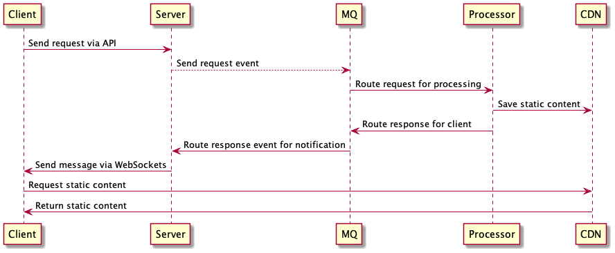

# ElasticMQ test

## Background

I started this repo to test ElasticMQ as a drop-in replacement for SQS for a simple content pipeline to generate notification data asynchronously.

Work started [based on a simplified version of this tutorial](https://github.com/alxolr/elasticmq-node-tutorial) but quickly got sidetracked proofing out a simple UI. For the message queue, I'm using [ElasticMQ's default Docker image](https://github.com/softwaremill/elasticmq) which seems to support ARM 64.



Gotchas:
- AWS' SDK is semi-magical in accessing cached credentials when developing locally, but of course these need to be explicitly passed in when launching via Docker Compose - see [env reference](./env.reference).

## TODO

- Add UUIDv4 identifiers for users
- Add WebSockets for client updates (https://ably.com/blog/web-app-websockets-nodejs):
  - After being created
  - After notifications have been received (can trigger reload from CDN if necessary)
- Add "intermediate" visual state notifications sent < notifications processed

## Requirements

To run, install:
- Docker Compose

Next, copy `.env.reference` to `.env` and configure values for AWS.

Finally, build/launch like so:
```
# Build web services/UI
docker-compose build web

# Launch containers
docker-compose up
```

Once launched, the following will be available:
- Web: http://localhost:3000/
- ElasticMQ UI: http://localhost:9325/

## Development

### Dependencies

On the app side:
- npm v8.3
- Node v17.3 (using Koa, and BBC's two SQS libraries: SQS Producer and SQS Consumer)
- Vanilla HTML/JS

## Alternatives

One could simply test using AWS mocks: https://github.com/dwyl/aws-sdk-mock